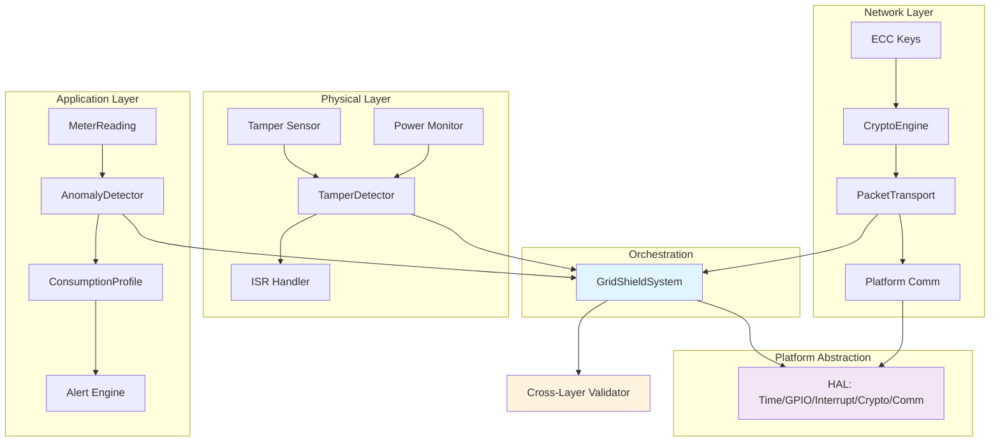
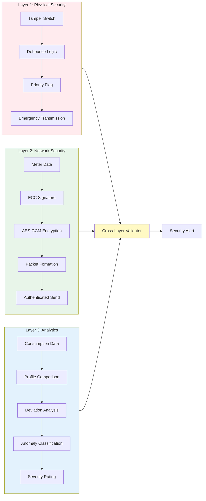
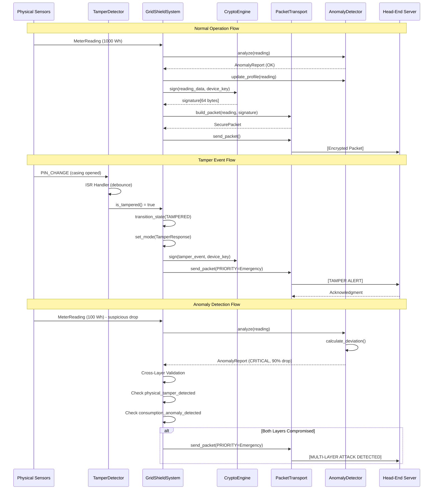
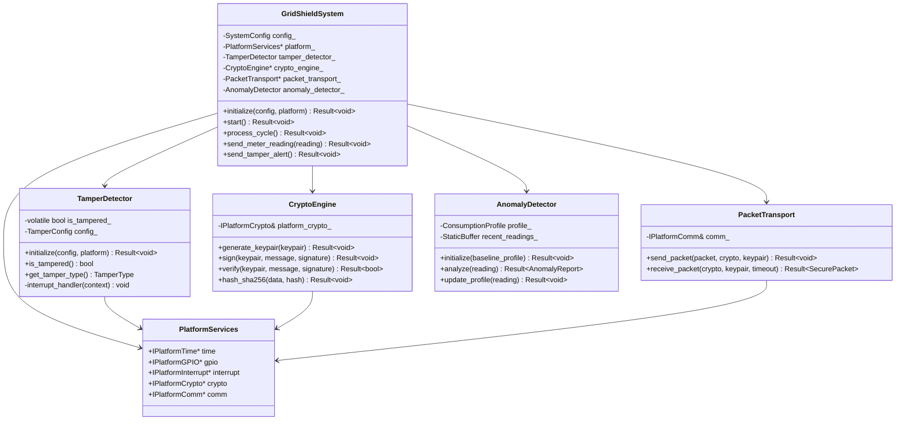
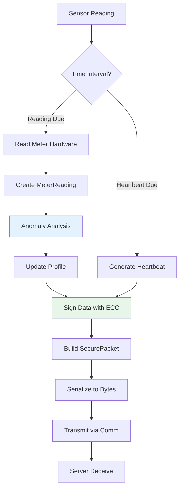
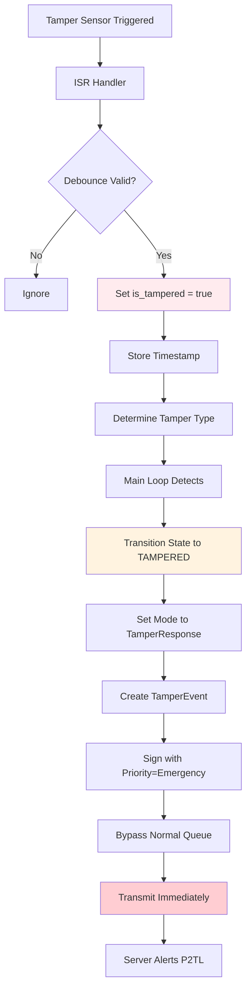
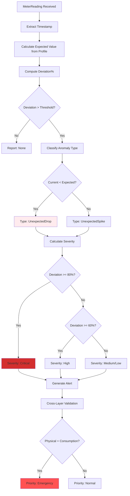

# GridShield - System Architecture

**Version:** 1.0.0  
**Last Updated:** February 2026  
**Authors:** M. Ichwan Fauzi, Rafi Indra Pramudhito Zuhayr, Cesar Ardika Bhayangkara

---

## Table of Contents

- [Overview](#overview)
- [High-Level Architecture](#high-level-architecture)
- [System Diagrams](#system-diagrams)
- [Layer Architecture](#layer-architecture)
- [Component Details](#component-details)
- [Data Flow](#data-flow)
- [Security Model](#security-model)
- [File Organization](#file-organization)
- [Memory Architecture](#memory-architecture)
- [Production Deployment](#production-deployment)

---

## Overview

GridShield is a production-grade, multi-layer security system designed for Advanced Metering Infrastructure (AMI). It implements a **Defense-in-Depth** strategy with three distinct security layers:

1. **Physical Security Layer** - Hardware tamper detection
2. **Network Security Layer** - Cryptographic authentication and integrity
3. **Application Security Layer** - Behavioral anomaly detection

### Key Characteristics

- **Language:** C++17 (embedded-friendly, no exceptions)
- **Memory Model:** Zero heap allocation, predictable stack usage
- **Platform Support:** Native (PC testing) + Arduino AVR (production)
- **Security:** ECC-based authentication, AES-GCM encryption, SHA-256 integrity
- **Architecture:** Layered design with Hardware Abstraction Layer (HAL)
- **Dependencies:** `rweather/Crypto` & `micro-ecc` (embedded on all platforms)

---

## High-Level Architecture

### System Overview Diagram



### Three-Layer Security Model



---

## System Diagrams

### Complete Data Flow



### Component Interaction



---

## Layer Architecture

### Layer 1: Physical Security

**Purpose:** Detect physical tampering attempts in real-time

**Components:**
- `TamperDetector` - ISR-safe tamper event handler
- `TamperConfig` - Debounce timing, sensitivity settings
- Platform GPIO/Interrupt abstraction

**Detection Mechanisms:**
- Casing open detection (limit switch)
- Power loss monitoring (backup capacitor)
- Magnetic interference detection
- Physical shock detection

**Flow:**
```
Sensor Trigger → ISR Handler → Debounce → Validate → Set Flag → Emergency Alert
```

**Key Features:**
- Interrupt-driven (non-blocking)
- Debounce logic (configurable, default 50ms)
- Priority flagging for immediate transmission
- Operates on backup power during main power loss

**Files:**
- `include/common/hardware/tamper.hpp`
- `src/common/hardware/tamper.cpp`

---

### Layer 2: Network Security

**Purpose:** Ensure authenticity, integrity, and confidentiality of transmitted data

**Components:**
- `CryptoEngine` - ECC signing, AES-GCM encryption, SHA-256 hashing
- `PacketTransport` - Secure packet serialization and transmission
- `SecurePacket` - Wire protocol with cryptographic protection

**Packet Structure:**
```
[HEADER: 24B] [PAYLOAD: 0-512B] [SIGNATURE: 64B] [FOOTER: 1B]
```

**Security Features:**
- **Authentication:** ECDSA signature (secp256r1)
- **Integrity:** SHA-256 checksum
- **Replay Protection:** Sequence numbers
- **Frame Validation:** Magic bytes (0xA5, 0x5A)

**Cryptographic Algorithms:**
- **ECC:** 256-bit Elliptic Curve (secp256r1)
- **Signature:** ECDSA (64 bytes: r + s)
- **Encryption:** AES-256-GCM (planned)
- **Hashing:** SHA-256 (32 bytes)

**Files:**
- `include/common/security/crypto.hpp`
- `src/common/security/crypto.cpp`
- `include/common/network/packet.hpp`
- `src/common/network/packet.cpp`

---

### Layer 3: Application Security

**Purpose:** Detect abnormal consumption patterns indicating manipulation

**Components:**
- `AnomalyDetector` - Statistical deviation analyzer
- `ConsumptionProfile` - Historical baseline (24-hour profile)
- `CrossLayerValidation` - Multi-layer threat correlation

**Detection Logic:**

```
Expected Value = hourly_avg_wh[current_hour]
Deviation% = |current - expected| / expected * 100

if Deviation% > Threshold:
    Classify Anomaly Type
    Calculate Severity (Low → Critical)
    Generate Alert
```

**Anomaly Types:**
- `UnexpectedDrop` - Sudden consumption decrease (tampering indicator)
- `UnexpectedSpike` - Unusual consumption increase
- `ZeroConsumption` - Complete power draw cessation
- `PatternDeviation` - Behavioral change from profile

**Profile Learning:**
- Continuously updates 24-hour consumption baseline
- Confidence increases with more data samples
- Adapts to seasonal/behavioral changes

**Files:**
- `include/common/analytics/detector.hpp`
- `src/common/analytics/detector.cpp`

---

## Component Details

### Core Module

#### error.hpp - Result<T> Monad

Type-safe error handling without exceptions:

```cpp
Result<MeterReading> read_meter() {
    if (sensor_failed) {
        return GS_MAKE_ERROR(ErrorCode::SensorReadFailure);
    }
    return Result<MeterReading>(reading);
}

// Usage
auto result = read_meter();
if (result.is_ok()) {
    process(result.value());
} else {
    log_error(result.error());
}
```

**Features:**
- No exceptions (embedded-safe)
- Automatic error context capture (file, line)
- `GS_TRY` macro for early returns
- Move semantics for zero-copy

#### types.hpp - Domain Types

**MeterReading (24 bytes):**
```cpp
struct MeterReading {
    timestamp_t timestamp;    // 8 bytes
    uint32_t energy_wh;       // 4 bytes
    uint32_t voltage_mv;      // 4 bytes
    uint16_t current_ma;      // 2 bytes
    uint16_t power_factor;    // 2 bytes
    uint8_t phase;            // 1 byte
    uint8_t reserved[3];      // 3 bytes (alignment)
};
```

**StaticBuffer<T, N>:**
- Fixed-size container (no heap allocation)
- Placement new for type-safe storage
- Move-only semantics
- Ideal for embedded systems

#### system.hpp - Main Orchestrator

**Responsibilities:**
- Lifecycle management (init → start → operate → shutdown)
- Layer coordination
- Cross-layer validation
- Automatic tamper response

**State Machine:**
```
Uninitialized → Initializing → Ready → Operating
                                  ↓
                              Tampered → Error → Shutdown
```

---

### Platform Abstraction Layer

**Interface Definitions:**
```cpp
class IPlatformTime {
    virtual timestamp_t get_timestamp_ms() = 0;
    virtual void delay_ms(uint32_t ms) = 0;
};

class IPlatformGPIO {
    virtual Result<void> configure(uint8_t pin, PinMode mode) = 0;
    virtual Result<bool> read(uint8_t pin) = 0;
    virtual Result<void> write(uint8_t pin, bool value) = 0;
};

class IPlatformCrypto {
    virtual Result<void> random_bytes(uint8_t* buffer, size_t length) = 0;
    virtual Result<uint32_t> crc32(const uint8_t* data, size_t length) = 0;
    virtual Result<void> sha256(const uint8_t* data, size_t length, uint8_t* hash) = 0;
};
```

**Implementations:**
- **Native:** `platform_native.hpp` - Uses `rweather/Crypto` & C++ STL
- **Arduino:** `platform_arduino.hpp` - Uses `rweather/Crypto` & Arduino API

**Benefits:**
- Platform-agnostic core logic
- Easy testing on PC
- Simple hardware porting

---

## Data Flow

### Normal Operation Flow



### Tamper Event Flow



### Anomaly Detection Flow



---

## Security Model

### Threat Model

**Threats Addressed:**

1. **Physical Tampering**
   - Casing removal/opening
   - Component replacement
   - Wire bypass
   - **Mitigation:** Tamper switches, power-loss detection

2. **Network Attacks**
   - Man-in-the-middle (MITM)
   - Replay attacks
   - Data injection
   - **Mitigation:** ECC signatures, sequence numbers, integrity checksums

3. **Consumption Manipulation**
   - Meter slowdown
   - Load masking
   - Data falsification
   - **Mitigation:** Anomaly detection, profile deviation analysis

### Defense Layers

```
┌─────────────────────────────────────────────────┐
│  Layer 3: Application Security                 │
│  • Anomaly Detection                            │
│  • Profile Learning                             │
│  • Cross-Layer Correlation                      │
├─────────────────────────────────────────────────┤
│  Layer 2: Network Security                     │
│  • ECDSA Authentication                         │
│  • AES-GCM Encryption                           │
│  • SHA-256 Integrity                            │
├─────────────────────────────────────────────────┤
│  Layer 1: Physical Security                    │
│  • Tamper Detection                             │
│  • Power-Loss Alerting                          │
│  • ISR-Safe Handlers                            │
└─────────────────────────────────────────────────┘
```

### Cryptographic Properties

**Elliptic Curve Cryptography (secp256r1):**
- Key Size: 256 bits (32 bytes private, 64 bytes public)
- Security Level: Equivalent to 3072-bit RSA
- Signature Size: 64 bytes (r + s)
- **Why ECC?** Smaller keys = less bandwidth + faster computation for embedded

**AES-256-GCM:**
- Encryption: 256-bit key
- Authentication: Built-in MAC (16-byte tag)
- Mode: Galois/Counter Mode (authenticated encryption)

**SHA-256:**
- Hash size: 256 bits (32 bytes)
- Collision resistance: 2^128 operations
- Used for: Packet integrity, message digests

---

## File Organization

### Directory Structure

```
gridshield/
├── CMakeLists.txt                      # Root build configuration
├── CMakePresets.json                   # Build presets (native, AVR)
├── BUILD.md                            # Build instructions
├── README.md                           # Project overview
│
├── include/                            # Header files
│   ├── common/                         # Platform-agnostic
│   │   ├── utils/
│   │   │   └── gs_macros.hpp           # C++17 macros (GS_MOVE, GS_LIKELY, etc.)
│   │   ├── core/
│   │   │   ├── error.hpp               # Result<T> monad, ErrorCode
│   │   │   ├── types.hpp               # MeterReading, StaticBuffer, etc.
│   │   │   └── system.hpp              # GridShieldSystem orchestrator
│   │   ├── security/
│   │   │   └── crypto.hpp              # CryptoEngine, ECCKeyPair
│   │   ├── hardware/
│   │   │   └── tamper.hpp              # TamperDetector
│   │   ├── network/
│   │   │   └── packet.hpp              # SecurePacket, PacketTransport
│   │   └── analytics/
│   │       └── detector.hpp            # AnomalyDetector
│   │
│   ├── platform/
│   │   └── platform.hpp                # HAL interfaces (IPlatformTime, etc.)
│   │
│   ├── native/
│   │   └── platform_native.hpp         # PC testing implementation
│   │
│   └── arduino/
│       └── platform_arduino.hpp        # AVR production implementation
│
├── src/                                # Implementation files
│   ├── common/
│   │   ├── core/system.cpp
│   │   ├── hardware/tamper.cpp
│   │   ├── security/crypto.cpp
│   │   ├── network/packet.cpp
│   │   └── analytics/detector.cpp
│   │
│   ├── platform/platform.cpp           # HAL common code
│   │
│   ├── native/
│   │   └── main.cpp                    # PC entry point (testing)
│   │
│   └── arduino/
│       └── gridshield.ino              # Arduino entry point (production)
│
├── docs/                               # Documentation
│   ├── ARCHITECTURE.md                 # This file
│   ├── API.md                          # API reference
│   ├── PROPOSAL.md                     # Project proposal
│   └── requirements.md                 # System requirements
│
└── bin/                                # Build outputs
    ├── NATIVE/GridShield               # PC executable
    └── AVR/GridShield.hex              # Arduino firmware
```

### Compilation Units

**Header-Only:**
- `gs_macros.hpp` - Platform detection, move semantics
- `error.hpp` - Result<T> template
- `types.hpp` - Domain type definitions
- `platform.hpp` - HAL interfaces

**Implementation Files:**
- `system.cpp` - Main orchestrator logic
- `tamper.cpp` - Physical security layer
- `crypto.cpp` - Cryptographic operations
- `packet.cpp` - Network protocol
- `detector.cpp` - Anomaly detection
- `main.cpp` / `gridshield.ino` - Entry points

---

## Memory Architecture

### Static Memory (BSS/Data)

| Component | Size | Description |
|-----------|------|-------------|
| System state | ~200 B | Configuration, flags, timestamps |
| Crypto buffers | ~256 B | Keys, signatures, hashes |
| Packet buffers | ~650 B | Header + payload + footer |
| Analytics profile | ~200 B | 24-hour consumption history |
| Recent readings | ~2.4 KB | StaticBuffer<MeterReading, 100> |
| **Total** | **~3.7 KB** | Well within 8 KB RAM limit |

### Stack Usage

| Context | Size | Description |
|---------|------|-------------|
| Main task | ~2.0 KB | Function call depth, local variables |
| ISR handlers | ~512 B | Interrupt service routine stack |
| **Total** | **~2.5 KB** | Peak usage during normal operation |

### Code Size (Flash)

| Component | Size (Estimated) | Notes |
|-----------|------------------|-------|
| Core logic | ~20 KB | System, tamper, analytics |
| Platform abstraction | ~5 KB | HAL implementations |
| Crypto (placeholder) | ~10 KB | Placeholder hashes/signatures |
| **Subtotal** | **~35 KB** | Without production crypto |
| + mbedTLS/uECC | +50 KB | Production cryptography |
| **Production Total** | **~85 KB** | Fits in 256 KB flash |

**Target Hardware:**
- **Arduino Mega 2560:** 256 KB flash, 8 KB RAM ✅
- **Arduino Uno:** 32 KB flash, 2 KB RAM ❌ (insufficient)

---

## Production Deployment

### Step 1: Hardware Platform Selection

**Recommended:** Arduino Mega 2560
- MCU: ATmega2560 @ 16 MHz
- Flash: 256 KB
- RAM: 8 KB
- EEPROM: 4 KB

**Alternative:** ESP32
- MCU: Xtensa LX6 @ 240 MHz
- Flash: 4 MB
- RAM: 520 KB
- WiFi/Bluetooth: Integrated

### Step 2: Crypto Library Integration

**Replace placeholder crypto with production libraries:**

```cpp
// In crypto.cpp
#include <uECC.h>        // Micro-ECC for ECDSA
#include <Crypto.h>      // Arduino Crypto for SHA-256

core::Result<void> CryptoEngine::sign(...) {
    const struct uECC_Curve_t* curve = uECC_secp256r1();
    if (!uECC_sign(keypair.get_private_key(), hash, 32, signature_out, curve)) {
        return GS_MAKE_ERROR(ErrorCode::SignatureInvalid);
    }
    return Result<void>();
}
```

### Step 3: Secure Key Storage

**Option A: ATECC608 Secure Element**
```cpp
#include <ATECC608.h>

ATECC608 secure_element;
secure_element.getPublicKey(slot, public_key);
secure_element.sign(slot, hash, signature);
```

**Option B: EEPROM Storage (Less Secure)**
```cpp
#include <EEPROM.h>

// Store encrypted key
EEPROM.put(KEY_ADDRESS, encrypted_private_key);
```

### Step 4: Communication Module

**LoRa (Long-Range, Low-Power):**
```cpp
#include <LoRa.h>

class LoRaComm : public IPlatformComm {
    Result<size_t> send(const uint8_t* data, size_t length) override {
        LoRa.beginPacket();
        LoRa.write(data, length);
        return Result<size_t>(LoRa.endPacket());
    }
};
```

**NB-IoT (Cellular Network):**
```cpp
#include <TinyGsmClient.h>

class NBIoTComm : public IPlatformComm {
    TinyGsm modem(SerialAT);
    Result<size_t> send(const uint8_t* data, size_t length) override {
        return modem.sendData(data, length);
    }
};
```

### Step 5: Sensor Integration

**Current Sensor (ACS712):**
```cpp
const int CURRENT_PIN = A0;
float read_current_ma() {
    int raw = analogRead(CURRENT_PIN);
    float voltage = (raw / 1024.0) * 5.0;
    float current = (voltage - 2.5) / 0.185;  // 5A sensor
    return current * 1000.0;  // Convert to mA
}
```

**Voltage Sensor (ZMPT101B):**
```cpp
const int VOLTAGE_PIN = A1;
float read_voltage_mv() {
    int raw = analogRead(VOLTAGE_PIN);
    float voltage = (raw / 1024.0) * 5.0 * (220.0 / 5.0);  // Scale factor
    return voltage * 1000.0;  // Convert to mV
}
```

### Step 6: Testing Strategy

**Unit Testing (PC):**
```bash
cmake --preset native-debug
cmake --build --preset native-debug
./bin/NATIVE/GridShield
```

**Integration Testing (Arduino):**
```bash
arduino-cli compile --fqbn arduino:avr:mega src/arduino/gridshield.ino
arduino-cli upload -p COM3 --fqbn arduino:avr:mega src/arduino/gridshield.ino
arduino-cli monitor -p COM3 -b 115200
```

**Hardware-in-Loop (HIL):**
- Simulate tamper events with physical switches
- Inject current/voltage variations
- Monitor serial output for correct responses

---

## Performance Benchmarks

**Target MCU:** ATmega2560 @ 16 MHz

| Operation | Time | Notes |
|-----------|------|-------|
| Tamper detection (ISR) | <5 ms | Interrupt-driven |
| SHA-256 hash (512B) | ~15 ms | Software implementation |
| ECC signature | ~50 ms | uECC library |
| AES-256 encrypt (512B) | ~20 ms | Crypto library |
| Anomaly analysis | <10 ms | Statistical computation |
| **Full cycle** | **<100 ms** | Sensor → Encrypt → Transmit |

**Power Consumption:**
- Active (processing): ~50 mA @ 5V
- Sleep (between cycles): <1 mA
- Tamper alert (backup power): ~20 mA for 5 seconds

---

## Extensibility Points

### Adding New Sensors

1. Extend `TamperType` enum:
```cpp
enum class TamperType : uint8_t {
    // Existing...
    MagneticInterference = 2,
    VibrationDetected = 7,     // NEW
};
```

2. Implement detection logic in `TamperDetector::handle_tamper_event()`

### Adding New Packet Types

1. Extend `PacketType` enum:
```cpp
enum class PacketType : uint8_t {
    // Existing...
    ConfigUpdate = 7,          // NEW
};
```

2. Add handler in `GridShieldSystem::process_cycle()`

### Adding New Anomaly Detectors

1. Implement `IAnomalyDetector` interface
2. Register with `GridShieldSystem`
3. Configure thresholds in `SystemConfig`

---

## Security Hardening Checklist

### Development Phase
- ✅ Zero heap allocation (predictable memory)
- ✅ Bounds checking on all buffers
- ✅ Volatile state in ISR handlers
- ✅ Result-based error handling (no exceptions)
- ✅ Type-safe interfaces (no void*)
- ✅ Const correctness throughout

### Production Phase
- [ ] Enable stack canaries (`-fstack-protector-strong`)
- [ ] Enable position-independent code (PIE)
- [ ] Implement secure erase for cryptographic keys
- [ ] Add watchdog timer support
- [ ] Implement secure boot chain
- [ ] Add OTA update with signature verification
- [ ] Implement rate limiting for anti-DoS
- [ ] Add encrypted logging to flash

---

## License & Attribution

**License:** MIT License - See LICENSE.md

**Developed by:**
- Muhammad Ichwan Fauzi (System Architecture)
- Rafi Indra Pramudhito Zuhayr (Firmware Implementation)
- Cesar Ardika Bhayangkara (Hardware Integration)

**Institut Teknologi PLN - 2025**

---

## References

- [C++17 Standard](https://en.cppreference.com/w/cpp/17)
- [Arduino Language Reference](https://www.arduino.cc/reference/en/)
- [micro-ecc Library](https://github.com/kmackay/micro-ecc)
- [Arduino Crypto Library](https://github.com/rweather/arduinolibs)
- [CMake Documentation](https://cmake.org/documentation/)