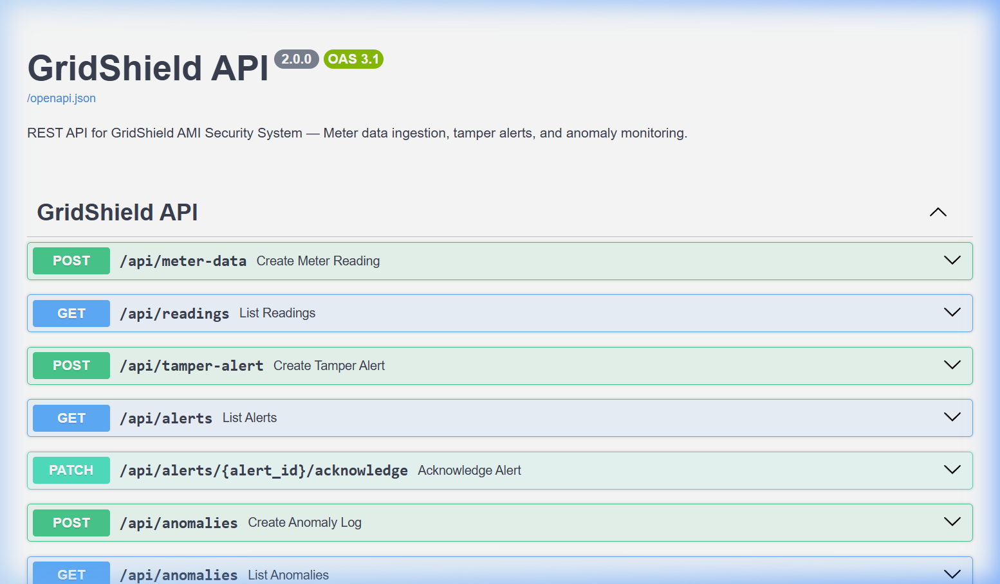
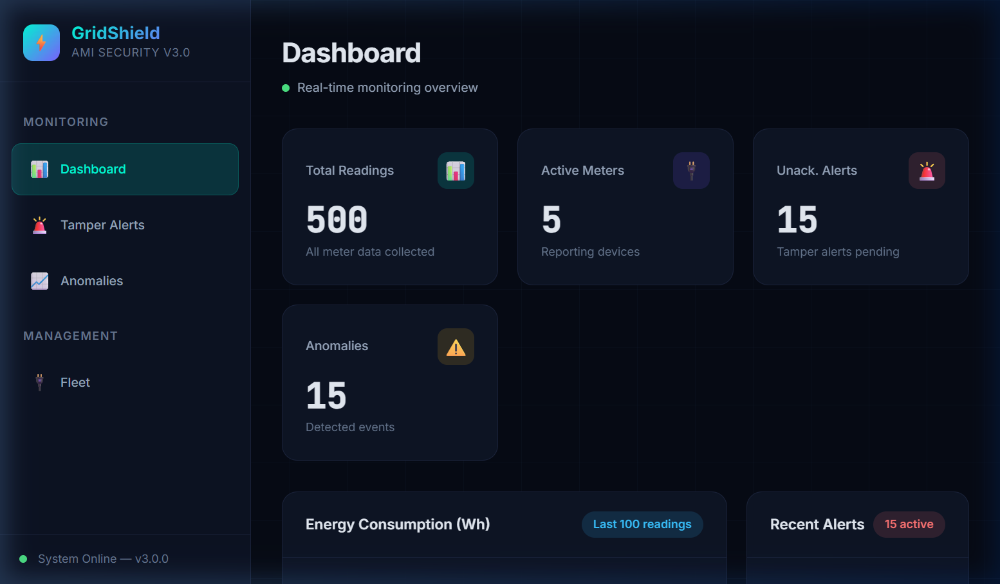
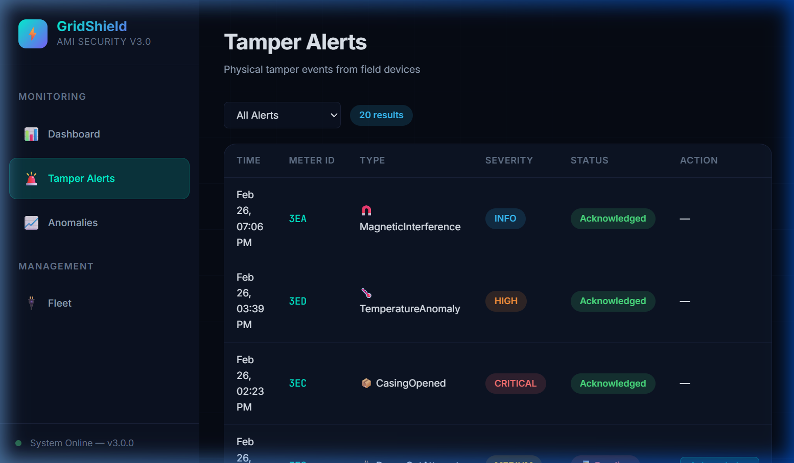
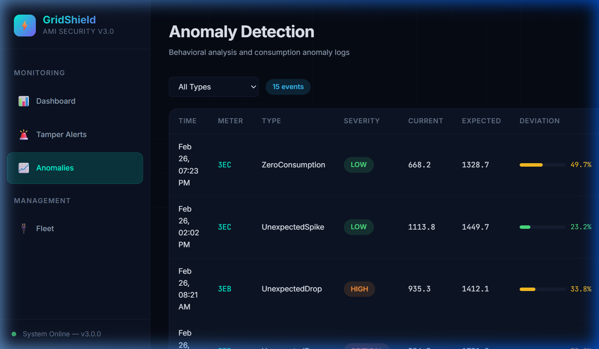
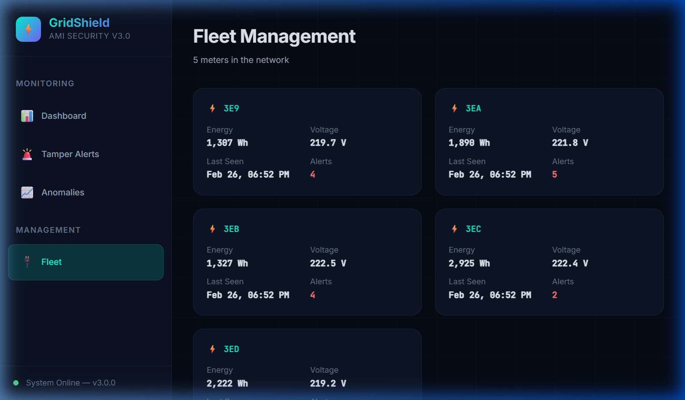

# GridShield - Quick Start Guide

Panduan langkah demi langkah untuk menjalankan **seluruh sistem GridShield** — mulai dari Backend API, Frontend Dashboard, hingga Firmware IoT.

---

## Daftar Isi

- [Persyaratan](#persyaratan)
- [Langkah 1 — Clone Repository](#langkah-1--clone-repository)
- [Langkah 2 — Jalankan Backend API](#langkah-2--jalankan-backend-api)
- [Langkah 3 — Jalankan Frontend Dashboard](#langkah-3--jalankan-frontend-dashboard)
- [Langkah 4 — Jalankan Firmware (QEMU / ESP32)](#langkah-4--jalankan-firmware-qemu--esp32)
- [Demo: Cara Kerja Sistem](#demo-cara-kerja-sistem)
- [Troubleshooting](#troubleshooting)

---

## Persyaratan

Pastikan software berikut sudah terinstal di komputer kamu:

| Software | Versi | Kegunaan | Download |
|----------|-------|----------|----------|
| **Git** | Any | Clone repository | [git-scm.com](https://git-scm.com/) |
| **Python** | 3.11+ | Backend API server | [python.org](https://www.python.org/downloads/) |
| **Node.js** | 18+ | Frontend dashboard | [nodejs.org](https://nodejs.org/) |
| **ESP-IDF** | v5.5+ | Firmware build (opsional) | [docs.espressif.com](https://docs.espressif.com/projects/esp-idf/en/stable/esp32/get-started/) |

> **💡 Tips:** Jika kamu hanya ingin melihat demo Backend + Frontend, cukup install Python dan Node.js saja. ESP-IDF hanya diperlukan untuk build firmware.

---

## Langkah 1 — Clone Repository

```powershell
git clone https://github.com/zuudevs/gridshield.git
cd gridshield
```

Struktur folder utama:

```
gridshield/
├── backend/       ← FastAPI REST API (Python)
├── frontend/      ← Dashboard Web (Vite + Chart.js)
├── firmware/      ← Firmware ESP32 (C++17)
└── docs/          ← Dokumentasi
```

---

## Langkah 2 — Jalankan Backend API

Backend menggunakan **FastAPI** dengan database **SQLite**.

### 2.1. Install Dependencies

```powershell
cd backend
pip install -r requirements.txt
```

> Jika `pip` tidak dikenali, coba: `py -m pip install -r requirements.txt`

### 2.2. Seed Database (Pertama Kali)

Database sudah terisi data contoh (`gridshield.db`). Jika ingin reset:

```powershell
py seed.py
```

### 2.3. Jalankan Server

```powershell
py -m uvicorn app.main:app --reload --port 8000
```

### 2.4. Verifikasi ✅

Buka browser dan akses:

| URL | Keterangan |
|-----|------------|
| http://localhost:8000/docs | 📖 Swagger UI — Dokumentasi API interaktif |
| http://localhost:8000/api/meters | 📡 Daftar meter yang terdaftar |
| http://localhost:8000/api/alerts | 🚨 Daftar tamper alert |
| http://localhost:8000/api/readings | 📊 Data pembacaan meter |
| http://localhost:8000/api/anomalies | ⚠️ Log deteksi anomali |

**Contoh tampilan Swagger UI:**



> **🎉 Berhasil!** Backend API kamu sudah berjalan di `localhost:8000`.

**⚠️ Jangan tutup terminal ini.** Biarkan server tetap berjalan.

---

## Langkah 3 — Jalankan Frontend Dashboard

Frontend menggunakan **Vite** + **Chart.js** — dashboard web real-time.

### 3.1. Install Dependencies

Buka **terminal baru** (jangan tutup backend):

```powershell
cd frontend
npm install
```

### 3.2. Jalankan Dev Server

```powershell
npm run dev
```

### 3.3. Buka Dashboard ✅

Buka browser: **http://localhost:5173**

Dashboard memiliki **4 halaman**:

| Halaman | URL | Fungsi |
|---------|-----|--------|
| **Dashboard** | `http://localhost:5173/` | Overview KPI, grafik konsumsi energi, alert terbaru |
| **Tamper Alerts** | `http://localhost:5173/#/alerts` | Manajemen alert keamanan fisik |
| **Anomalies** | `http://localhost:5173/#/anomalies` | Log deteksi anomali konsumsi |
| **Fleet** | `http://localhost:5173/#/fleet` | Manajemen dan monitoring meter |

**Tampilan Dashboard:**



**Tampilan Tamper Alerts:**



**Tampilan Anomaly Detection:**



**Tampilan Fleet Management:**



> **🎉 Berhasil!** Frontend dashboard kamu sudah terhubung dengan backend API.

---

## Langkah 4 — Jalankan Firmware (QEMU / ESP32)

Firmware ditulis dalam **C++17** menggunakan **ESP-IDF v5.5**.

### Opsi A: Simulasi QEMU (Tanpa Hardware)

```powershell
# Install QEMU (sekali saja)
.\scripts\script.ps1 --setup

# Build firmware
.\scripts\script.ps1 --build

# Jalankan di QEMU
.\scripts\script.ps1 --run
```

Atau secara manual:

```powershell
cd firmware
idf.py set-target esp32     # Set target (sekali saja)
idf.py build                # Build firmware
idf.py qemu monitor         # Jalankan di QEMU
```

### Opsi B: Flash ke ESP32 (Hardware Asli)

Hubungkan ESP32 ke komputer via USB, lalu:

```powershell
cd firmware
idf.py set-target esp32
idf.py build
idf.py -p COM3 flash        # Ganti COM3 sesuai port kamu
idf.py -p COM3 monitor      # Monitor serial output
```

> **💡 Tips:** Cek port COM di Device Manager → Ports (COM & LPT).

### Output yang Diharapkan ✅

```
[GridShield] ==============================================
[GridShield] GridShield v3.0.1 [ESP32 - QEMU Simulation]
[GridShield] Platform: ESP-IDF + QEMU
[GridShield] ==============================================

[GridShield] [Init] Configuring system...
[GridShield]   Meter ID: 0x1234567890ABCDEF
[GridShield]   Tamper Pin: 4 | Debounce: 50ms
[GridShield]   Max Cycles: 20

[GridShield] System started successfully
[GridShield] Entering main processing loop...

[GridShield] Cycle 1/20 OK
[GridShield] Cycle 2/20 OK
...
[GridShield] Cycle 20/20 OK
[GridShield] Simulation complete — all cycles finished
```

> **🎉 Berhasil!** Firmware multi-layer security berjalan — tamper detection, crypto, dan anomaly detection aktif.

---

## Demo: Cara Kerja Sistem

### Arsitektur Keseluruhan

```
┌──────────────┐     Serial/WiFi     ┌──────────────┐     HTTP API     ┌──────────────┐
│   ESP32      │ ──────────────────► │   Backend    │ ◄────────────── │   Frontend   │
│   Firmware   │                     │   FastAPI    │                  │   Dashboard  │
│              │                     │              │                  │              │
│ • Tamper Det │                     │ • REST API   │                  │ • KPI Charts │
│ • Crypto     │                     │ • SQLite DB  │                  │ • Alert Mgmt │
│ • Anomaly    │                     │ • Analytics  │                  │ • Fleet View │
└──────────────┘                     └──────────────┘                  └──────────────┘
   Port: COM3                         Port: 8000                        Port: 5173
```

### Alur Kerja

1. **Firmware (ESP32)** membaca sensor, mendeteksi tamper, dan mengirim data terenkripsi ke backend
2. **Backend (FastAPI)** menerima data, menyimpan ke SQLite, dan menjalankan analisis anomali
3. **Frontend (Dashboard)** mengambil data dari backend via REST API dan menampilkan visualisasi real-time

### 3 Layer Keamanan

| Layer | Fungsi | Teknologi |
|-------|--------|-----------|
| **🔐 Physical** | Deteksi gangguan fisik pada meter | ISR + GPIO + debounce |
| **🌐 Network** | Enkripsi dan autentikasi paket data | ECDSA (secp256r1) + SHA-256 |
| **📊 Analytics** | Deteksi anomali konsumsi listrik | Statistical analysis + ML |

---

## Troubleshooting

### ❌ `python` / `pip` tidak ditemukan

```powershell
# Gunakan 'py' (Windows launcher)
py -m pip install -r requirements.txt
py -m uvicorn app.main:app --reload --port 8000
```

### ❌ `npm` tidak ditemukan

Install [Node.js](https://nodejs.org/) dan restart terminal.

### ❌ ESP-IDF tidak ditemukan

```powershell
# Aktifkan environment ESP-IDF
C:\esp\v5.5.3\esp-idf\export.bat
```

### ❌ QEMU tidak ditemukan

```powershell
.\scripts\script.ps1 --setup
```

### ❌ Port COM tidak terdeteksi

1. Buka **Device Manager** → **Ports (COM & LPT)**
2. Cari "Silicon Labs CP210x" atau "CH340"
3. Ganti `COM3` dengan port yang muncul

### ❌ Frontend tidak menampilkan data

Pastikan backend sudah berjalan di port 8000 **sebelum** menjalankan frontend.

---

## Langkah Selanjutnya

| Dokumen | Isi |
|---------|-----|
| [Architecture](ARCHITECTURE.md) | Desain sistem lengkap dengan diagram |
| [API Reference](API.md) | Dokumentasi endpoint firmware & backend |
| [Build Guide](../BUILD.md) | Konfigurasi build lanjutan |
| [Tech Stack](TECHSTACK.md) | Teknologi yang digunakan |
| [Roadmap](ROADMAP.md) | Rencana pengembangan |

---

**Institut Teknologi PLN — 2026**