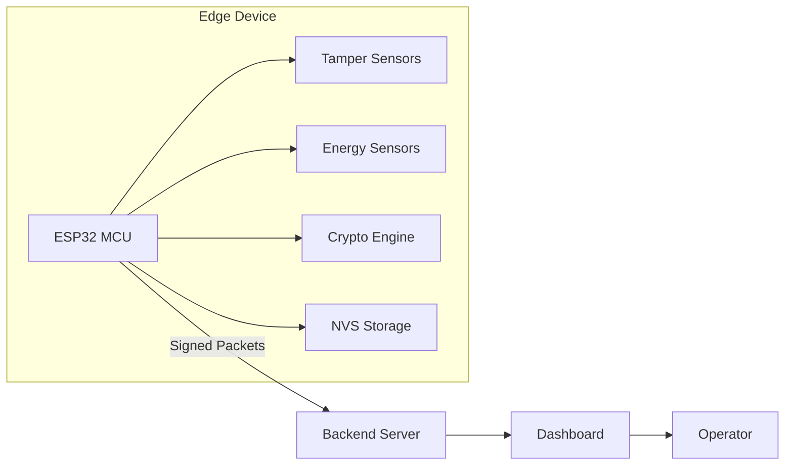

# Threat Model — GridShield

**Version:** 2.0.1  
**Date:** February 2026  
**Methodology:** STRIDE (Spoofing, Tampering, Repudiation, Information Disclosure, Denial of Service, Elevation of Privilege)

---

## 1. System Overview

GridShield is a smart electricity meter tamper detection system deployed on ESP32 microcontrollers. It monitors energy consumption, detects anomalies, and reports tamper events to a central server.

### Architecture Diagram



### Trust Boundaries

| Boundary | Description |
|----------|-------------|
| **TB-1** | Physical device enclosure |
| **TB-2** | ESP32 ↔ Communication channel |
| **TB-3** | Backend server ↔ Dashboard |
| **TB-4** | NVS Flash storage |

---

## 2. Assets

| Asset | Sensitivity | Location |
|-------|-------------|----------|
| ECC Private Keys | **Critical** | NVS (encrypted) |
| Meter Readings | **High** | RAM / Transit |
| Firmware Binary | **High** | Flash |
| Configuration | **Medium** | NVS |
| Tamper Event Logs | **Medium** | RAM / Transit |
| Device Identity (meter_id) | **Medium** | NVS + Firmware |

---

## 3. STRIDE Analysis

### 3.1 Spoofing

| ID | Threat | Target | Likelihood | Impact | Mitigation |
|----|--------|--------|-----------|--------|-------------|
| T-S1 | Attacker spoofs meter readings | TB-2 | Medium | High | ECDSA packet signatures |
| T-S2 | Rogue device impersonates legitimate meter | TB-2 | Medium | High | Device-unique ECC keypair |
| T-S3 | Spoofed server sends malicious commands | TB-2 | Low | Critical | Server public key verification |

### 3.2 Tampering

| ID | Threat | Target | Likelihood | Impact | Mitigation |
|----|--------|--------|-----------|--------|-------------|
| T-T1 | Physical bypass of tamper sensor | TB-1 | High | High | Multi-sensor fusion (planned) |
| T-T2 | Firmware modification via JTAG/UART | TB-1 | Medium | Critical | Secure Boot v2 + eFuse lockdown |
| T-T3 | NVS key data modification | TB-4 | Low | Critical | Flash encryption + CRC integrity |
| T-T4 | Packet modification in transit | TB-2 | Medium | High | SHA-256 checksum + ECDSA signature |

### 3.3 Repudiation

| ID | Threat | Target | Likelihood | Impact | Mitigation |
|----|--------|--------|-----------|--------|-------------|
| T-R1 | Meter denies sending tamper alert | TB-2 | Low | Medium | ECDSA non-repudiation (signed packets) |
| T-R2 | No audit trail of key rotations | System | Medium | Medium | Telemetry counters + NVS logging (planned) |

### 3.4 Information Disclosure

| ID | Threat | Target | Likelihood | Impact | Mitigation |
|----|--------|--------|-----------|--------|-------------|
| T-I1 | Private key extraction from flash | TB-4 | Medium | Critical | Flash encryption + Secure Boot |
| T-I2 | Packet sniffing reveals consumption data | TB-2 | High | Medium | AES-GCM payload encryption (planned) |
| T-I3 | Debug logs leak sensitive data | System | Low | Low | Production log level `WARN` |
| T-I4 | Side-channel attacks on crypto | TB-1 | Low | High | mbedTLS constant-time operations |

### 3.5 Denial of Service

| ID | Threat | Target | Likelihood | Impact | Mitigation |
|----|--------|--------|-----------|--------|-------------|
| T-D1 | Network flooding prevents reporting | TB-2 | Medium | High | Retry with backoff + local buffering |
| T-D2 | Watchdog starvation via long operations | System | Low | Medium | 30s WDT + operation timeouts |
| T-D3 | NVS write wear-out | TB-4 | Low | Medium | Rate-limit config saves |
| T-D4 | Resource exhaustion (stack/heap) | System | Low | High | Static allocation, no heap (`StaticBuffer`) |

### 3.6 Elevation of Privilege

| ID | Threat | Target | Likelihood | Impact | Mitigation |
|----|--------|--------|-----------|--------|-------------|
| T-E1 | Buffer overflow in packet parser | System | Medium | Critical | Fixed-size buffers, bounds checking |
| T-E2 | Firmware downgrade attack | TB-1 | Low | High | Secure Boot anti-rollback (planned) |
| T-E3 | Unauthenticated OTA update | TB-2 | Low | Critical | Signed firmware + Secure Boot |

---

## 4. Risk Matrix

```
Impact ↑
Critical │ T-T2  T-I1  T-E1  T-E3  T-S3
         │ T-T3
High     │ T-S1  T-T1  T-T4  T-I2  T-D1  T-E2
         │ T-S2  T-D4
Medium   │ T-R1  T-R2  T-D2  T-D3
Low      │ T-I3
         └──────────────────────────────────→ Likelihood
           Low    Medium    High
```

---

## 5. Residual Risks

After all planned mitigations:

| Risk | Status | Notes |
|------|--------|-------|
| Physical device access | **Accepted** | Cannot fully prevent physical tampering |
| Side-channel attacks | **Accepted** | mbedTLS provides baseline protection |
| Quantum computing threats | **Deferred** | Post-quantum crypto in roadmap (2027+) |
| Supply chain attacks | **Accepted** | Use verified ESP-IDF + mbedTLS releases |

---

## 6. Next Review

- **Q3 2026:** After communication protocol implementation
- **Q4 2026:** After cloud integration + OTA updates
- **Annually** thereafter, or after any security incident
